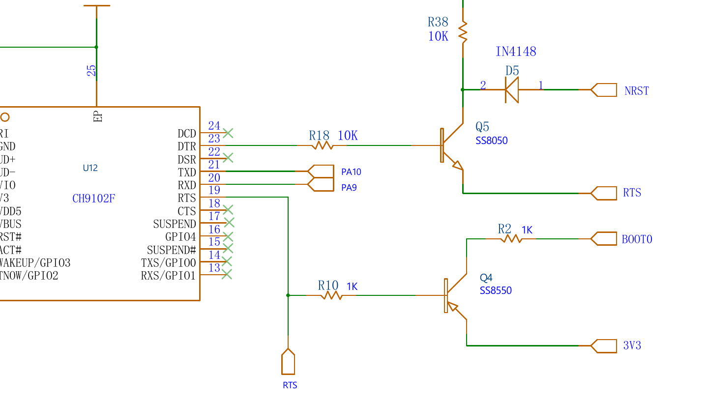

# Lab 02 — RRC Lite Firmware

**Raspberry Pi 5 · Hiwonder RRC Lite (STM32F407VET6) · Ubuntu Server 24.04 · ROS 2 Jazzy**

**Objectives:** Connect the RRC Lite controller to the Pi 5 and understand how they talk:
the serial link, the `0xAA 0x55` packet protocol and what the firmware sends on its own.
Use that to find out **which firmware the board runs**. Then install the Linux tools for
STM32 flashing, **back up** the current firmware, and **flash new firmware from the Pi**
over the same USB-C cable with `stm32flash`. Finish by running Hiwonder's
`ros_robot_controller` ROS 2 node against the board.

---

## Before You Start

- **Lab 01 is done**: the Pi runs Ubuntu Server 24.04 with ROS 2 Jazzy, and `ssh robot01` works
- The **RRC Lite** board, its battery (power input **DC 5–12.6 V**, e.g. a 2S or 3S Li-ion pack), and a **USB-A to USB-C data cable** (not a charge-only cable)
- On your laptop, the Hiwonder **Appendix** folder and the board's schematic
  (`1. RRC Lite Hardware Course/Lesson 2 …/SCH_Ros Robot Controller Lite V1.0.pdf`). This lab uses:

| Appendix path | What it is |
|---|---|
| `Factory Firmware/RosRobotControllerLite_ros_250814.hex` | the factory firmware, Intel HEX |
| `Source Code/RosRobotControllerLite_ros_250814/` | its source: STM32CubeMX + FreeRTOS, a Keil MDK-ARM project |
| `ROS Development Package/ROS2/ros_robot_controller-ros2/src/` | Hiwonder's ROS 2 packages: `ros_robot_controller` (node + Python SDK) and `ros_robot_controller_msgs` |
| `ROS Development Package/RRCLite Communication Protocol with the Host Computer Analysis.pdf` | the packet protocol (Part 3) |
| `Factory Firmware/Firmware Flashing Tutorial.pdf`, `Firmware Download Troubleshooting Guide/` | Hiwonder's flashing guide, for Windows (Part 5.3) |

Copy what the Pi needs, from the **laptop**:

```bash
cd "<path>/Appendix"
ssh robot01 'mkdir -p ~/lab02 ~/ros2_ws/src'
scp "Factory Firmware/RosRobotControllerLite_ros_250814.hex" robot01:~/lab02/
scp -r "ROS Development Package/ROS2/ros_robot_controller-ros2/src/"* robot01:~/ros2_ws/src/
```

And the lab's own scripts, on the **Pi**:

```bash
cd ~/lab02
for f in 99-rrclite.rules rrclite_probe.py flash_rrclite.sh; do
  curl -fsSLO {{ site.github.url }}/Lab_02/code/$f
done
```

⬇️ [99-rrclite.rules](code/99-rrclite.rules) · ⬇️ [rrclite_probe.py](code/rrclite_probe.py) ·
⬇️ [flash_rrclite.sh](code/flash_rrclite.sh)

---

## Part 1 — The board

| Part | Details |
|---|---|
| Microcontroller | **STM32F407VET6**: Arm Cortex-M4F at 168 MHz, **512 KB flash** from `0x08000000`, 192 KB RAM |
| USB-serial chip | **CH9102F**, USB ID **`1a86:55d4`**, on the Type-C port labelled **UART1** |
| Host link | STM32 **USART1** (pins PA9/PA10) ↔ CH9102F ↔ USB ↔ the Pi's `/dev/ttyACM0` |
| Firmware | Hiwonder *RosRobotControllerLite* "ros" firmware, version 250811 (the factory `…_250814.hex` is byte-for-byte the `.hex` in the source folder) |
| On the board | 4 encoder-motor ports, PWM servo ports, a serial bus-servo port, QMI8658 IMU, buzzer, LEDs, keys K1/K2, battery voltage sensing, SBUS input, USB-host port for a gamepad |
| Buttons for flashing | **RST** (NRST, with a 10 kΩ pull-up and 100 nF capacitor C12) and **BOOT** (pulls BOOT0 high) |
| SWD header | **J1**, 4 pins: 1 = 3V3, 2 = GND, 3 = SWDIO (PA13), 4 = SWCLK (PA14) |
| Power | battery → switch **S1** → `VIN` (motors, servos) → regulators for 5 V and 3.3 V. The UART1 port's USB **VBUS also feeds the 5 V rail** through diode D3, so **the STM32 runs from the USB cable alone**: no battery needed to probe or flash |
| Power for the Pi | a **5 V / 5 A USB-C output with USB-PD** (SY8370 converter + IP2723T PD chip), meant to power the Raspberry Pi 5 from the robot's battery (Lab 01, *Power*) |

**PA9/PA10 is also where the STM32's built-in ROM bootloader listens.** That is why the
same USB-C cable is used both to drive the robot and to flash it. Hiwonder's
troubleshooting guide says it too: the UART1 Type-C port is *the only port that can
flash the board*.

> **Firmware vs. bootloader.** The *firmware* is your program in flash, and it speaks
> Hiwonder's protocol at 1 Mbaud. The *ROM bootloader* is ST's, burned into the chip at
> the factory. It can't be erased, so a failed flash never "bricks" the board: you can
> always get back to the bootloader and flash again.

---

## Part 2 — Connect the board to the Pi

### 2.1 Plug in and find it

Plug the USB-C end of the data cable into the board's **UART1** port and the USB-A end
into any USB port on the Pi. The board's logic powers up from the cable; the battery is
only needed for motors and servos (and for the Pi's power on the robot).

> **Two USB-C ports, two jobs.** **UART1** is the data link to the Pi. The **5 V PD output**
> powers the Pi. On the robot both cables are connected: the PD output to the Pi's USB-C
> power input, and UART1 to one of the Pi's USB-A ports.
>
> Hiwonder's FAQ calls the 5V5A port *"serial port 2"*, but it is **power only**: it has no
> serial chip behind it and can't be used to talk to or flash the board.

```bash
lsusb | grep 1a86
# Bus 003 Device 002: ID 1a86:55d4 QinHeng Electronics USB Single Serial
sudo dmesg | tail -5
# cdc_acm 3-1:1.0: ttyACM0: USB ACM device
ls -l /dev/ttyACM*
# crw-rw---- 1 root dialout 166, 0 ... /dev/ttyACM0
```

The CH9102F uses the standard `cdc_acm` driver that is already in Ubuntu's kernel, so
no driver install is needed.

### 2.2 Permission to use the port

Serial ports belong to the `dialout` group. Add yourself once, then **log out and in again**:

```bash
sudo usermod -aG dialout $USER
exit                          # then ssh robot01 again
groups                        # ... dialout ...
```

### 2.3 A fixed name: the udev rule

`ttyACM0` can become `ttyACM1` when another USB-serial device (a lidar, say) is plugged
in first. The udev rule gives the board a name that never changes, `/dev/rrclite`, and
tells ModemManager (if installed) not to probe it:

```bash
cd ~/lab02
sudo cp 99-rrclite.rules /etc/udev/rules.d/
sudo udevadm control --reload-rules && sudo udevadm trigger
ls -l /dev/rrclite            # -> /dev/rrclite -> ttyACM0
```

> **Hiwonder's own rule** (`ros_robot_controller/scripts/99-ttyACM0.rules`) does the
> ModemManager part, but sets `MODE="0777"` and `GROUP="ubuntu"` on *every* `ttyACM0`.
> Use the rule above instead. Don't install both.

---

## Part 3 — How the Pi talks to the firmware

This summarises *RRCLite Communication Protocol with the Host Computer Analysis.pdf*,
checked against the firmware source (`Hiwonder/Misc/packet.c`, `Hiwonder/System/packet_handle.c`)
and Hiwonder's Python SDK (`ros_robot_controller_sdk.py`).

### 3.1 Serial settings

**1 000 000 baud, 8 data bits, no parity, 1 stop bit** (8N1), no flow control.
The firmware sets this up on USART1 (`USART1.BaudRate=1000000` in `RosRobotControllerM4.ioc`).

### 3.2 Frame format (both directions)

| Byte | Field | Notes |
|---|---|---|
| 0–1 | `0xAA 0x55` | start of frame |
| 2 | function | what the frame is about (table below) |
| 3 | length | number of data bytes, 0–255 |
| 4 … | data | the parameters, **little-endian** (`1000` = `0xE8 0x03`) |
| last | CRC-8 | over function, length and data. Dallas/Maxim CRC-8: reflected polynomial `0x8C`, start value 0 |

> The SDK's comment in `PacketControllerState` lists *Length* before *Function*. The code,
> the firmware and the PDF all use **function, then length**.

### 3.3 Function codes

| Code | Name | Pi → board | Board → Pi |
|---|---|---|---|
| 0 | `SYS` | battery low-voltage limit (sub-command 1) | **battery voltage every ~1 s**: sub-command `0x04` + `uint16` millivolts |
| 1 | `LED` | `u8 id, u16 on ms, u16 off ms, u16 repeat` | |
| 2 | `BUZZER` | `u16 Hz, u16 on ms, u16 off ms, u16 repeat` | |
| 3 | `MOTOR` | sub-cmd `0x00` one motor, `0x01` several, `0x02` stop one, `0x03` stop by bit mask; speeds are `float` rev/s | |
| 4 | `PWM_SERVO` | set position(s) (pulse 500–2500 µs), offset, read position/offset | replies to reads |
| 5 | `BUS_SERVO` | move, torque on/off, ID, offset, limits, read position/voltage/temperature | replies to reads |
| 6 | `KEY` | | key events: `u8 key id, u8 event` (click, long press, …) |
| 7 | `IMU` | | **~50 Hz**: 6 × `float` (accel x y z, gyro x y z) |
| 8 | `GAMEPAD` | | USB gamepad state |
| 9 | `SBUS` | | RC receiver channels |
| 10 | `OLED` | text for an OLED display | |
| 11 | `RGB` | RGB LED colours | |

> **Motor IDs.** In the frame, motors are numbered **from 0**. The SDK's
> `set_motor_speed([[1, 0.3], …])` takes 1–4 and subtracts 1. The PDF's examples use 1.

> Codes 10 and 11 exist in this firmware but not in the ROS 2 SDK, which stops at 9.

### 3.4 Worked examples

The CRC values below were computed with the SDK's own `checksum_crc8()`:

| Command | Bytes |
|---|---|
| LED 1: on 100 ms, off 100 ms, 5 times | `AA 55 01 07 01 64 00 64 00 05 00 37` |
| Buzzer: 1400 Hz, on 100 ms, off 100 ms, 5 times | `AA 55 02 08 78 05 64 00 64 00 05 00 F0` |
| Buzzer: 1000 Hz, on 100 ms, off 900 ms, once | `AA 55 02 08 E8 03 64 00 84 03 01 00 2E` |
| Stop motors 1–4 (mask `0b1111`) | `AA 55 03 02 03 0F D3` |
| *(from the board)* battery 7.40 V | `AA 55 00 03 04 E8 1C 2B` |

Try one by hand. Python is enough, no ROS 2 needed:

```bash
python3 -c "
import serial; s = serial.Serial('/dev/rrclite', 1000000)
s.write(bytes.fromhex('AA 55 02 08 E8 03 64 00 84 03 01 00 2E'))"
```

The board beeps once. Change one byte without fixing the CRC, and it stays silent: the
firmware drops frames with a wrong checksum.

---

## Part 4 — Which firmware is running?

There is no "get version" command in the protocol. There are two ways to tell.

### 4.1 By behaviour: `rrclite_probe.py`

The probe listens at 1 Mbaud, decodes every frame and reports what it sees. With
`--beep` it also sends the buzzer command from Part 3.4:

```bash
cd ~/lab02
python3 rrclite_probe.py --beep --seconds 3
```

```
Port /dev/rrclite at 1000000 baud
-> BUZZER  AA 55 02 08 E8 03 64 00 84 03 01 00 2E

Received 4210 bytes in 3.0 s: 150 good frames, 0 bad CRC, 0 stray bytes
  SYS            3 frames  (  1.0 /s)   last: SYS battery 7.82 V
  IMU          147 frames  ( 49.0 /s)   last: IMU accel 0.01 -0.02 1.00  gyro 0.12 -0.30 0.05

RESULT: the board runs firmware that speaks Hiwonder's 0xAA 0x55 protocol at 1 Mbaud.
        Battery + IMU reports match the RosRobotControllerLite 'ros' firmware.
```

| You see | It means |
|---|---|
| battery ~1/s + IMU ~50/s, beep heard | Hiwonder's ROS firmware (the factory one, or one built from its source) |
| bytes arrive but no valid frames | another firmware, or another baud rate |
| nothing at all | no firmware, board off, or the board is sitting in the bootloader (power-cycle it) |

`--raw` prints every frame in hex; `--led` blinks the LED instead.

### 4.2 Exactly: compare the flash with a `.hex`

The bootloader can read the flash back. `flash_rrclite.sh compare` reads as many bytes as
the `.hex` file holds and compares them:

```bash
bash flash_rrclite.sh compare RosRobotControllerLite_ros_250814.hex
# OK  IDENTICAL: the board runs RosRobotControllerLite_ros_250814.hex
```

That needs the tools from Part 5 and the bootloader from Part 6. Come back to it after Part 6.

> **Read protection.** If a reading step fails with *Failed to read memory*, the chip has
> read-out protection (RDP level 1) turned on. You can still flash it, but turning RDP off
> (`stm32flash -k`) **erases the whole chip**, so there is no backup in that case.

---

## Part 5 — Tools for flashing on Linux

### 5.0 What you need

Everything below runs **on the Pi**. A Linux laptop works the same way.

| | Item | Why |
|---|---|---|
| **Required** | the RRC Lite and a **USB-A to USB-C data cable** into its **UART1** port | the only port that can flash; the cable also powers the STM32, so the battery can stay off |
| **Required** | `stm32flash` | the flashing tool (5.1) |
| **Required** | the firmware: a **`.hex`** (or `.bin`) built for the RRC Lite | the factory `Appendix/Factory Firmware/…_250814.hex`, a lesson example (Part 7.4), or your own build (Part 8) |
| Comes with Ubuntu | `python3`, `psmisc` (`fuser`) | `flash_rrclite.sh` uses them to read `.hex` files and to check the port isn't busy |
| Recommended | `picocom`, `binutils`, `python3-serial` | look at the port, convert HEX ↔ BIN, run the probe and the ROS 2 node |
| Recommended | `flash_rrclite.sh`, `rrclite_probe.py`, `99-rrclite.rules` | this lab's scripts (*Before You Start*) |
| Optional | an **ST-Link** or **J-Link** + `stlink-tools` / `openocd` / SEGGER J-Link software | flashing and debugging over **SWD** through header **J1**, when the USB route can't be used (5.2) |
| Not needed | ATK-XISP, FlyMcu, Flash Loader Demonstrator, the serial assistants, `SetupSTM32CubeMX-6.8.1-Win.exe`, Keil MDK | Hiwonder's Windows tools (5.3). Keil MDK is only needed to *build* new firmware (Part 8) |

No driver needs installing: the CH9102F uses Linux's built-in `cdc_acm` driver (Part 2.1).

### 5.1 Install

```bash
sudo apt install -y stm32flash psmisc picocom binutils python3-serial
command -v stm32flash               # /usr/bin/stm32flash
```

| Tool | Used for |
|---|---|
| **`stm32flash`** | the main tool: talks to the STM32's ROM bootloader over a serial port (ST's AN3155 protocol). Reads `.hex` and `.bin`, erases, writes, verifies, and toggles DTR/RTS to enter and leave the bootloader |
| `picocom` | a serial terminal, to look at the port by hand (`picocom -b 1000000 /dev/rrclite`, quit with `Ctrl+A Ctrl+X`) |
| `binutils` | `objcopy -I ihex -O binary fw.hex fw.bin` converts between HEX and raw binary |
| `python3-serial` | `pyserial`: the probe, Hiwonder's SDK and the ROS 2 node |
| `psmisc` | `fuser`: shows which program has the serial port open |

### 5.2 Other options (not needed for this lab)

| Tool | When |
|---|---|
| **STM32CubeProgrammer** (ST, free, GUI + `STM32_Programmer_CLI`) | on an **x86-64 Linux laptop** (no arm64 build, so not on the Pi). It does the same UART flashing: `STM32_Programmer_CLI -c port=/dev/ttyACM0 br=115200 -w fw.hex -v -rst`. You may have to put the board in the bootloader first (`flash_rrclite.sh` leaves it there if interrupted) |
| `stlink-tools` (`st-flash`) or `openocd` + an **ST-Link** | flashing and **debugging** over **SWD**, through the 4-pin header **J1** (3V3, GND, SWDIO, SWCLK; connect 3V3 only as the reference, power the board from USB). Works even when the UART route doesn't. Hiwonder's developers used a J-Link this way (the source has a `.jflash` file) |
| `arm-none-eabi-gcc` | compiling the firmware on Linux. The Hiwonder project is set up for **Keil MDK** (Windows), see Part 8 |

### 5.3 What Hiwonder's Windows tools do

The *Software* folder has **ATK-XISP**, **FlyMcu** and ST's **Flash Loader Demonstrator**.
They are Windows-only, and all three do what `stm32flash` does on Linux. Hiwonder's
tutorial sets ATK-XISP to **115200 baud** and **"Reset@DTR Low(<-3V), ISP@RTS High"**. That
setting describes the board's auto-download circuit, which Part 6 explains.

---

## Part 6 — How the board gets into its bootloader

At reset, the STM32 checks its **BOOT0** pin:

| BOOT0 at reset | The chip starts |
|---|---|
| low | your firmware, from flash at `0x08000000` |
| high | ST's ROM bootloader, which waits for `0x7F` on USART1, measures the baud rate from it, and then accepts AN3155 commands at **8 data bits, even parity** (8E1) |

There are two ways to get there: the **buttons**, or the **auto-download circuit** that
lets the Pi do it over the cable.

### 6.1 The buttons

1. Hold **BOOT** (BOOT0 high)
2. Press and release **RST**: the chip restarts and sees BOOT0 high → bootloader
3. Release **BOOT**

The bootloader keeps running until the next reset. To go back to the firmware, press
**RST** alone.

### 6.2 The auto-download circuit

From the schematic, sheet 1, *serial port / download circuit*:



| Part | Wiring | Effect |
|---|---|---|
| **Q4** (SS8550, PNP) | base ← R10 ← CH9102F **RTS#**; emitter 3V3; collector → R2 → **BOOT0** | RTS# low → **BOOT0 high** |
| **Q5** (SS8050, NPN) | base ← R18 ← CH9102F **DTR#**; emitter → **RTS#**; collector → D5 → **NRST** | DTR# high **and** RTS# low → **NRST low (reset)** |

A program sets the lines with *on* (asserted, pin **low**) and *off* (pin **high**):

| RTS | DTR | BOOT0 | NRST | What it's for |
|---|---|---|---|---|
| off | off | low | released | idle: the port is closed |
| off | on | low | released | **running**: safe while a program talks to the firmware |
| on | on | **high** | released | what Linux sets when a port is opened (see the note below) |
| on | off | **high** | **held low** | reset, ready for the bootloader |

So, in stm32flash's `-i` syntax (`rts`/`dtr` = on, `-rts`/`-dtr` = off, `,` = wait 100 ms,
`&` = no wait):

```
entry:  rts&-dtr , dtr      reset with BOOT0 high, then DTR on releases the reset
                            while RTS keeps BOOT0 high       -> ROM bootloader
exit:   rts&-dtr , -rts     reset again, then RTS off: BOOT0 falls within
                            microseconds (10 kΩ pull-down), NRST rises over
                            ~1 ms (10 kΩ + 100 nF C12)      -> your firmware
```

The exit works because of that difference in speed: releasing RTS releases both pins at
once, but BOOT0 is already low when NRST comes back up. This is the board's
*"Reset@DTR Low, ISP@RTS High"* setting in ATK-XISP (Part 5.3).

> **An open port holds BOOT0 high.** Linux turns on both DTR and RTS when a program
> opens a serial port. That doesn't reset the board, so the firmware keeps running, but
> BOOT0 stays high. If the board resets while the port is open (RST pressed, a brown-out
> when the motors start), it comes back up **in the bootloader** and goes silent.
> `rrclite_probe.py` avoids this by opening the port with DTR on and RTS off. Part 9
> applies the same one-line fix to Hiwonder's SDK. (The firmware has a watchdog driver,
> but never starts it, so it doesn't reset the board on its own.)

### 6.3 Reach the bootloader

Stop anything that uses the port (the ROS 2 node from Part 9, a `picocom`, the probe), then:

```bash
cd ~/lab02
bash flash_rrclite.sh info
```

Something like:

```
==> Entering the bootloader with DTR/RTS:  -i 'rts&-dtr,dtr:rts&-dtr,-rts'
    OK  bootloader answered (0x0413 (STM32F40xxx/41xxx))

==> Chip information
Interface serial_posix: 115200 8E1
Version      : 0x31
Option 1     : 0x00
Option 2     : 0x00
Device ID    : 0x0413 (STM32F40xxx/41xxx)
- RAM        : Up to 128KiB  (12288b reserved by bootloader)
- Flash      : Up to 1024KiB (size first sector: 1x16384)
- Option RAM : 16b
- System RAM : 30KiB
```

**`Device ID: 0x0413`** is the STM32F40x/41x family: the bootloader is reachable. The exit
sequence has already reset the board into its firmware. Run
`python3 rrclite_probe.py --beep` to check that the firmware is running again.

> stm32flash reports the family's largest flash (1024 KiB). The F407**VE** has 512 KB.

If the bootloader doesn't answer, use the buttons. With `--manual`, the script asks you to
press them instead of using DTR/RTS:

```bash
bash flash_rrclite.sh --manual info
```

### 6.4 The same thing by hand

The script runs ordinary `stm32flash` commands:

```bash
SEQ='rts&-dtr,dtr:rts&-dtr,-rts'
stm32flash -b 115200 -i "$SEQ" -R /dev/rrclite                    # chip info, then run
stm32flash -b 115200 -i "$SEQ" -r backup.bin -S 0x08000000:524288 -R /dev/rrclite
stm32flash -b 115200 -i "$SEQ" -w firmware.hex -v -R /dev/rrclite  # write + verify + run

# with the buttons (BOOT held, RST tapped, BOOT released) instead of -i:
stm32flash -b 115200 -w firmware.hex -v -R /dev/rrclite
```

---

## Part 7 — Back up, then flash

### 7.1 Back up the current firmware

```bash
bash flash_rrclite.sh backup
# OK  saved rrclite_backup_20261007_101500.bin  (md5 ...)
```

This reads the whole 512 KB flash (about a minute). Copy it to your laptop with
`scp robot01:lab02/rrclite_backup_*.bin .` and keep it. To put it back later:
`stm32flash -b 115200 -i 'rts&-dtr,dtr:rts&-dtr,-rts' -w rrclite_backup_….bin -v -R /dev/rrclite`.
A `.bin` has no addresses, and stm32flash writes it from the start of flash.

Now try the exact check from Part 4.2:

```bash
bash flash_rrclite.sh compare RosRobotControllerLite_ros_250814.hex
```

### 7.2 Flash

Practise with the factory firmware: writing what the board already runs changes nothing,
and the steps are the same for any new `.hex`:

```bash
bash flash_rrclite.sh flash RosRobotControllerLite_ros_250814.hex
```

```
    OK  RosRobotControllerLite_ros_250814.hex: 51460 bytes at 0x08000000, md5 f32bbdc5c19ac6469b63f659dd2ca781
==> Entering the bootloader with DTR/RTS:  -i 'rts&-dtr,dtr:rts&-dtr,-rts'
    OK  bootloader answered (0x0413 (STM32F40xxx/41xxx))

    This ERASES the firmware on the board and writes RosRobotControllerLite_ros_250814.hex.
    Made a backup first?  (bash flash_rrclite.sh backup)
    Type 'yes' to flash: yes

==> Erasing, writing and verifying (about 30-60 s). Don't unplug the board.
Erasing memory
Wrote and verified address 0x0800c904 (100.00%) Done.
Resetting device...
    OK  written and verified - the board was reset into the new firmware
```

What happens:

| Step | Done by |
|---|---|
| check the `.hex`: valid records and checksums, fits in 512 KB from `0x08000000` | the script |
| DTR/RTS entry sequence → bootloader (Part 6.2), `0x7F` → baud rate locked at 115200 | stm32flash `-i` |
| erase only the flash sectors the image covers | stm32flash (default for `-w`) |
| write in 256-byte blocks, read each one back (`-v`) | stm32flash |
| exit sequence: reset, then BOOT0 drops before NRST rises → the new firmware starts (Part 6.2) | stm32flash `-R` |

### 7.3 Check the result

```bash
python3 rrclite_probe.py --beep
bash flash_rrclite.sh compare RosRobotControllerLite_ros_250814.hex
```

The probe should show the same battery and IMU frames as in Part 4.1, and the board beeps.

> **If flashing stops halfway** (cable pulled), the old firmware is partly erased and the
> board won't answer at 1 Mbaud. That is fine: the ROM bootloader is untouched. Fix the
> cause and run the same `flash` command again, or use the buttons (`--manual`).

### 7.4 Practise: flash a different firmware, then restore

Hiwonder's lessons in `RRC Lite Controller/3. RRC Lite Program Analysis/` each come with a
ready-built `.hex` for this board, inside the zip at
`…/MDK-ARM/RosRobotControllerM4/RosRobotControllerM4.hex`. All of them start at
`0x08000000`, so they flash the same way as the factory firmware:

| Lesson | Zip | Size |
|---|---|---|
| 2 — LED and buzzer | `2.3 LED & Buzzer Program.zip` (two programs: *1.Buzzer Program*, *2.LED Program*) | ~43 KB |
| 3 — Buttons | `rosrobotcontrollerm4_key_buzzer.zip` | ~44 KB |
| 6 — RGB LEDs | `RRCLite_RGB.zip` | ~50 KB |
| 9 — Bus servos | `RRCLite_Bus servo2.zip` | ~50 KB |
| 11, 12 — Encoder motors, PID | `RosRobotControllerLite_ros.zip` | ~52 KB |

On the laptop, take the hex out of the zip and copy it over (Lesson 6 as the example):

```bash
cd "<path>/RRC Lite Controller/3. RRC Lite Program Analysis/Lesson 6 RGB LED Display Source Code Analysis"
unzip -j -o RRCLite_RGB.zip 'RRCLite_RGB/MDK-ARM/RosRobotControllerM4/RosRobotControllerM4.hex'
scp RosRobotControllerM4.hex robot01:~/lab02/lesson06_rgb.hex
```

On the Pi:

```bash
cd ~/lab02
bash flash_rrclite.sh flash lesson06_rgb.hex                          # the demo runs: watch the RGB LEDs
python3 rrclite_probe.py                                              # does the demo still speak the protocol?
bash flash_rrclite.sh compare RosRobotControllerLite_ros_250814.hex   # -> DIFFERENT
bash flash_rrclite.sh flash RosRobotControllerLite_ros_250814.hex     # restore the factory firmware
python3 rrclite_probe.py --beep                                       # battery + IMU again
```

Lesson demos are cut-down programs: some don't send the battery and IMU frames, so the
probe may report less, or nothing. Flash the **factory firmware** again before Part 9:
the ROS 2 node needs it.

---

## Part 8 — Where new firmware comes from

The `.hex` you flash is built from Hiwonder's source with **Keil MDK-ARM** on Windows
(`MDK-ARM/RosRobotControllerM4.uvprojx`). Hiwonder's *Firmware Flashing Tutorial.pdf*,
part 1, shows the build:

1. **Project → Options for Target → Output** → tick **Create HEX File**
2. **Project → Build Target** (F7). The `.hex` lands in the project's output folder
3. Copy it to the Pi and flash it (Part 7.2):

```bash
scp RosRobotControllerM4.hex robot01:~/lab02/        # from the Windows/laptop side
ssh robot01 'cd ~/lab02 && bash flash_rrclite.sh flash RosRobotControllerM4.hex'
```

Version-control what you change: the source folder is already a git repository
(`git log` shows Hiwonder's history).

> **Building on Linux** means moving the project off Keil: regenerate it from
> `RosRobotControllerM4.ioc` with STM32CubeMX as a *Makefile* or *CMake* project and build
> with `arm-none-eabi-gcc`. Keil-specific parts (the `armclang` startup file, scatter
> file, compiler flags) need replacing. That is a project of its own and is not needed to
> flash a `.hex`.

---

## Part 9 — Run Hiwonder's ROS 2 node

The node (`ros_robot_controller`) opens `/dev/ttyACM0` at 1 Mbaud using the SDK from Part 3
and turns frames into ROS 2 topics. You copied it to `~/ros2_ws/src` in *Before You Start*.

First, the one-line fix from Part 6.2: after opening the port, turn RTS off, so BOOT0
stays low while the node runs and a reset brings back the firmware, not the bootloader:

```bash
cd ~/ros2_ws/src/ros_robot_controller/ros_robot_controller
grep -n 'self.port = serial.Serial' ros_robot_controller_sdk.py
sed -i 's/^\(\s*\)self.port = serial.Serial(device, baudrate, timeout=timeout)$/&\n\1self.port.rts = False  # keep BOOT0 low (auto-download circuit)/' ros_robot_controller_sdk.py
grep -n -A1 'self.port = serial.Serial' ros_robot_controller_sdk.py
#     self.port = serial.Serial(device, baudrate, timeout=timeout)
#     self.port.rts = False  # keep BOOT0 low (auto-download circuit)
```

DTR stays on, so turning RTS off never resets the board. Then build:

```bash
cd ~/ros2_ws
ls src                                   # ros_robot_controller  ros_robot_controller_msgs
rosdep install --from-paths src --ignore-src -y
colcon build --symlink-install
source ~/.bashrc
ros2 launch ros_robot_controller ros_robot_controller.launch.xml
```

In a second SSH session:

```bash
ros2 topic list | grep ros_robot_controller
ros2 topic echo /ros_robot_controller/battery          # millivolts, ~1/s
ros2 topic hz /ros_robot_controller/imu_raw            # ~50 Hz
ros2 topic pub --once /ros_robot_controller/set_buzzer ros_robot_controller_msgs/msg/BuzzerState \
  "{freq: 1000, on_time: 0.1, off_time: 0.9, repeat: 1}"
```

| Topic | Type | Direction |
|---|---|---|
| `~/battery` | `std_msgs/UInt16` | board → ROS |
| `~/imu_raw` | `sensor_msgs/Imu` | board → ROS |
| `~/button`, `~/joy`, `~/sbus` | keys, gamepad, RC | board → ROS |
| `~/set_buzzer`, `~/set_led`, `~/set_motor` | `BuzzerState`, `LedState`, `MotorsState` | ROS → board |
| `~/pwm_servo/set_state`, `~/bus_servo/set_state` | servo commands | ROS → board |
| `~/pwm_servo/get_state`, `~/bus_servo/get_state` | services | ROS ↔ board |

To give the robot its own namespace (Lab 01, Part 9.3), start it with `ros2 run` instead:

```bash
ros2 run ros_robot_controller ros_robot_controller --ros-args -r __ns:=/$(hostname)
# topics: /robot01/ros_robot_controller/battery, ...
```

> **Stop the node (`Ctrl+C`) before flashing.** Only one program can hold the serial port,
> and `flash_rrclite.sh` refuses to start while something else has it open.

---

## Troubleshooting

| Problem | Try this |
|---------|---------|
| No `1a86:55d4` in `lsusb` | Cable in the **UART1** Type-C port? A charge-only cable has no data wires. Try another Pi USB port |
| `Permission denied: '/dev/ttyACM0'` | `sudo usermod -aG dialout $USER`, then log out and in (Part 2.2) |
| `/dev/rrclite` missing | Rule not installed or not reloaded (Part 2.3). `udevadm info -a /dev/ttyACM0 \| grep -m2 'idVendor\|idProduct'` |
| Probe: *nothing received* | The board is waiting in the bootloader: press **RST**, or `bash flash_rrclite.sh run`. Or there is no firmware: flash one (Part 7) |
| The board went silent after RST was pressed or the motors started, while the ROS 2 node ran | It reset with BOOT0 held high by the open port and is in the bootloader (Part 6.2). Press RST, and apply the SDK fix in Part 9 |
| Probe: bytes but *no valid frames* | Another firmware or another baud rate. `picocom -b 115200 /dev/rrclite` to look |
| Probe: many *bad CRC* | Two programs read the port (the ROS 2 node is running), or a bad cable |
| `flash_rrclite.sh`: *in use by another program* | Stop the ROS 2 node / picocom / probe. `fuser -v /dev/rrclite` shows who |
| `The bootloader did not answer` / `Failed to init device` | Retry: Hiwonder's guide says *COM_CMD_TIMEOUT* is often fixed by trying again. Then use the buttons: `bash flash_rrclite.sh --manual info`. Then `--baud 57600`. Last resort: SWD through J1 (Part 5.2) |
| Stalls at `Erasing memory` | Erasing a 128 KB F4 sector takes 1–2 s each. Wait 30 s. If it hangs, retry (Hiwonder's guide 2.3) |
| `Failed to write memory` / verify error | Retry. If it repeats: a lower baud rate (`--baud 57600`), a shorter cable, or a weak battery |
| `Failed to read memory` on backup/compare | The chip is read-protected (Part 4.2). Flashing still works |
| After flashing the board doesn't answer | Press RST once. Was it a `.hex` for **this** board (RRC Lite, STM32F407VE)? Flash the factory `.hex` or your backup again |
| `colcon build` fails on `ros_robot_controller_msgs` | `rosdep install --from-paths src --ignore-src -y`, then build again. Read the first error in `log/latest_build/` |
| Node: `could not open port /dev/ttyACM0` | The board is on another `ttyACM` number, or the port is busy. Check `ls -l /dev/rrclite` |

---

## Completion Checklist

- [ ] `lsusb` shows `1a86:55d4`, you are in `dialout`, and `/dev/rrclite` exists
- [ ] You can explain a frame: `AA 55`, function, length, little-endian data, CRC-8
- [ ] The hand-typed buzzer frame from Part 3.4 makes the board beep
- [ ] `rrclite_probe.py` shows battery ~1/s and IMU ~50/s
- [ ] `stm32flash`, `picocom`, `binutils` installed
- [ ] You can explain from the schematic how DTR/RTS drive NRST and BOOT0
- [ ] `flash_rrclite.sh info` reaches the bootloader (`Device ID: 0x0413`), and so does `--manual` with the buttons
- [ ] A backup `.bin` of the original firmware is on your laptop
- [ ] `flash_rrclite.sh compare` says which firmware the board runs
- [ ] The factory `.hex` was flashed and verified, and the probe still shows the firmware running
- [ ] A lesson example was flashed, and the factory firmware restored afterwards (Part 7.4)
- [ ] The SDK opens the port with RTS off (Part 9), `ros_robot_controller` builds, launches, and `set_buzzer` beeps the board from ROS 2
